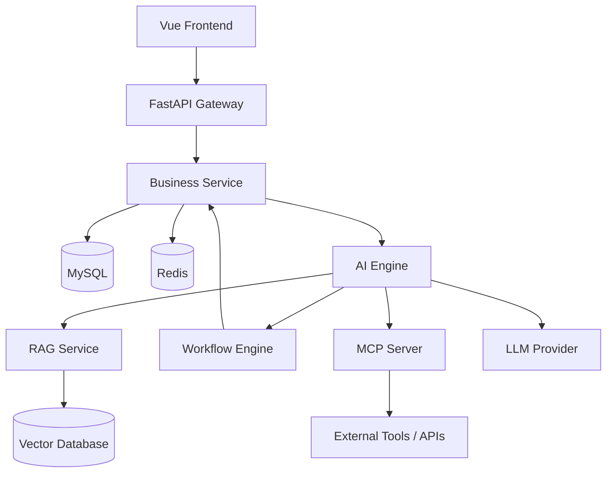
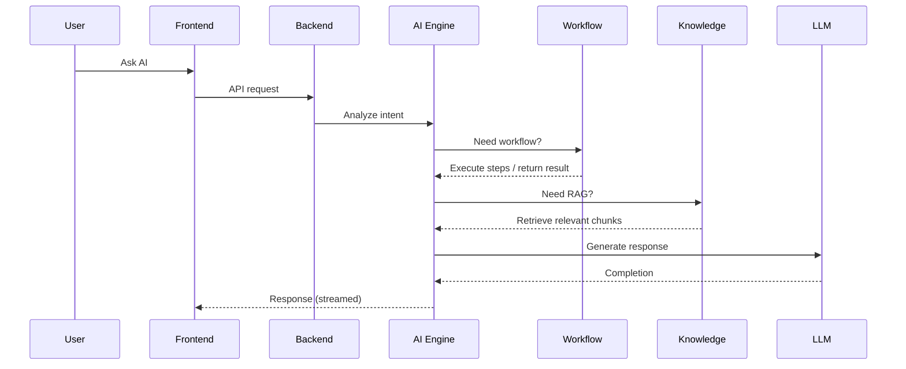
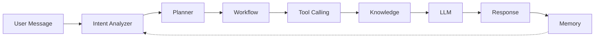
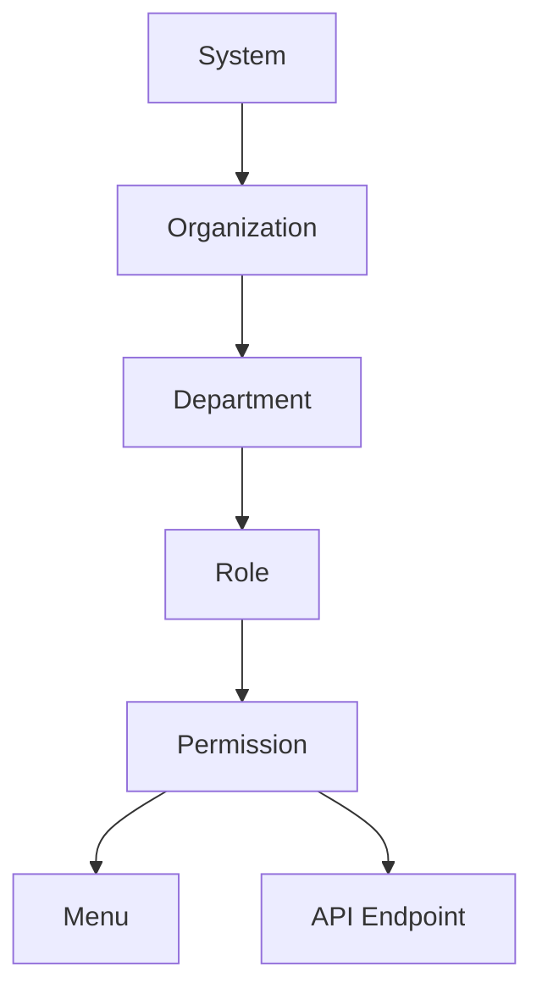
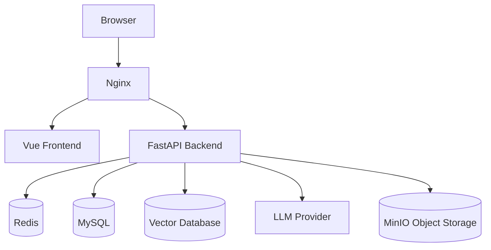
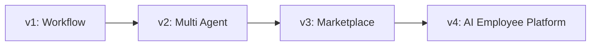

# WorkMind System Design

> Version: v0.1 | Status: Draft | Date: 2026-07-16
> Related: [Product Requirements](../product/requirements.md) · [Architecture Overview](overview.md) · [Roadmap](../roadmap/roadmap.md)

---

## 1. Design Principles

WorkMind follows the following design principles. Every architectural decision in this document should trace back to one of these.

### 1.1 Modular

Every module should be independently developed, tested, and deployed.

Modules communicate through well-defined APIs, not shared internal state. A module can be replaced without rewriting the modules around it.

### 1.2 AI First

Every business module should be able to integrate AI.

AI is not an independent feature bolted onto the product. AI is a capability that any module — Workflow, Knowledge, Task — can call into, the same way any module can call the database.

### 1.3 Plugin-oriented

All AI capabilities should be extensible, not hardcoded.

- Support MCP (Model Context Protocol)
- Support Tool Calling
- Support custom plugins

New capabilities should be addable without modifying core engine code.

### 1.4 Cloud Native

- Support Docker deployment as the default distribution model
- Support horizontal scaling of stateless services
- Support Kubernetes as a future deployment target, without requiring architecture changes to adopt it

### 1.5 Security

- RBAC (Role-Based Access Control)
- JWT-based authentication
- Operation logging for all state-changing actions
- API-level authentication on every service boundary
- Data isolation between organizations (multi-tenant safe)

### 1.6 Observability

- Structured logging across all services
- Metrics for request volume, latency, and AI token usage
- Tracing across service boundaries, especially through the AI pipeline where a single user request may touch Knowledge, Workflow, and LLM services

---

## 2. Architecture Overview

WorkMind is organized into three layers: a frontend layer, a gateway/business layer, and an AI/data layer. The AI layer is not a side feature — it sits alongside the business layer and is reachable from it in both directions.

**Reading the diagram:**

- The **frontend** never talks to the AI Engine directly — everything passes through the gateway so auth, rate limiting, and logging are enforced once, centrally.
- The **AI Engine** is the hub. It can call the Knowledge base (RAG), trigger a Workflow, or reach external tools through MCP — and Workflow can call back into Business Service to actually mutate state (create a record, send a notification).
- The **Vector Database** is a separate concern from MySQL. Structured business data and semantic knowledge have different access patterns and don't belong in the same store.

---

## 3. Core Modules

Each module owns a clear slice of responsibility. No module should need to reach into another module's internals to do its job — only its API.

### User Center

Responsible for:
- User accounts and profiles
- Organization and membership
- Login, session, and JWT issuance

### Knowledge Center

Responsible for:
- Knowledge base management
- Document ingestion
- OCR for scanned/image documents
- Embedding generation
- Chunking strategy
- Retrieval (semantic + keyword)

### Workflow Engine

Responsible for:
- Workflow definition and versioning
- Approval flows
- Task orchestration
- Automatic execution and triggers (scheduled, event-based)

### AI Engine

Responsible for:
- LLM invocation and provider abstraction
- Prompt management
- Agent execution
- Tool calling
- Memory (short-term conversation, long-term context)
- Planning (breaking a goal into steps)

### Plugin Center

Responsible for:
- MCP server/client integration
- Plugin registration and lifecycle
- Third-party API adapters

### Task Center

Responsible for:
- Task queue and status tracking
- Scheduler (cron-like and event-driven triggers)
- Background job execution and retry

### System Center

Responsible for:
- Logging and audit trail
- Monitoring and metrics
- System configuration
- AI model registry and routing (which model handles which request)

---

## 4. System Workflow

This sequence shows how a single user question flows through the system when it requires both a workflow decision and a knowledge lookup — the general case, not the simple chat case.

Not every request touches every branch. A simple factual question skips Workflow entirely. A "submit my expense report" request skips Knowledge and goes straight through Workflow. The Intent Analyzer (see Chapter 5) decides which branches are needed per request.

---

## 5. AI Architecture

This chapter is what separates WorkMind from a chatbot wrapper. The core idea: **a user message is a goal, not just a prompt.** The system decides what needs to happen to satisfy that goal before it ever calls an LLM to phrase the answer.

### 5.1 Pipeline

- **Intent Analyzer** — classifies what the user actually wants: a question, a task, an approval, a lookup.
- **Planner** — for anything beyond a single-turn answer, breaks the goal into ordered steps.
- **Workflow** — executes any steps that map to a defined business process (approval, data pull, notification).
- **Tool Calling** — invokes discrete tools (search, calculator, internal API) as individual steps.
- **Knowledge** — retrieves grounding context from the knowledge base when the answer must cite company-specific information.
- **LLM** — synthesizes the final natural-language response from everything gathered above.
- **Memory** — persists the interaction (short-term for this conversation, long-term for future ones) and feeds back into the next Intent Analyzer pass.

### 5.2 Why not LangChain?

LangChain is built around chains: linear or lightly-branching sequences of calls. WorkMind's core requirement is **planning with revisable state** — the system needs to decide mid-task whether to call a tool again, re-plan after a workflow step fails, or loop back to the knowledge step with a refined query. Chains are the wrong abstraction for that; the control flow needs to be a graph with cycles, not a pipe.

### 5.3 Why LangGraph?

LangGraph models the AI Engine as an explicit state graph. Each node (Intent Analyzer, Planner, Workflow, Tool Calling, Knowledge, LLM) is a graph node with its own state transition. This gives us:

- **Cycles** — the Planner can send control back to Tool Calling if a step's output changes the plan.
- **Explicit state** — the full execution state (what's been retrieved, what's been called, what's pending) is inspectable, which is required for the "AI answers must be traceable" principle in the [Product Requirements](../product/requirements.md#第十一章产品原则product-principles).
- **Checkpointing** — a long-running Agent task can be paused and resumed, which chains don't support natively.

### 5.4 Why Planning?

Most AI chat products treat every message as a single LLM call: prompt in, completion out. That works for Q&A. It does not work for "process this invoice and notify finance" — that request is actually five to ten discrete steps, several of which depend on the outcome of the previous one. Planning is what turns WorkMind from a chatbot into something that can act as an employee: it decomposes a goal before executing, and can adjust the plan when a step's result changes what's needed next.

### 5.5 Why MCP?

Model Context Protocol standardizes how an AI Engine discovers and calls external tools and data sources, independent of which LLM provider is behind it. Without MCP, every new tool integration would be a bespoke adapter tied to one model's function-calling format. With MCP:

- Tool and plugin authors write one integration, usable by any MCP-compatible model.
- WorkMind's Plugin Center (Chapter 3) can expose internal capabilities (knowledge search, workflow triggers) as MCP servers, making them consumable by external AI clients too — not just WorkMind's own AI Engine.
- Switching LLM providers (OpenAI → Claude → DeepSeek → Qwen, per the compatibility requirement in the PRD) doesn't require re-writing tool integrations.

---

## 6. Permission Architecture

Permissions follow a strict hierarchy. Nothing at a lower level can grant access that wasn't already scoped at a higher level — this is what keeps multi-tenant and multi-department data isolated as the org chart grows.

- **System** — the platform level. Controls which organizations exist and global settings.
- **Organization** — a tenant. All data below this level is scoped to the organization; no cross-organization data access is possible by default.
- **Department** — a subdivision within an organization (HR, Sales, Operations). Used for data visibility scoping (e.g., a department's Workflow instances are only visible within that department unless explicitly shared).
- **Role** — a named bundle of permissions (Admin, Editor, Viewer) assignable to users within a department.
- **Permission** — the atomic unit: a specific action on a specific resource type.
- **Menu / API** — permissions ultimately resolve to two enforcement points: what's visible in the frontend (Menu) and what's callable in the backend (API). The frontend check is UX; the API check is the actual security boundary — the frontend hiding a button is never sufficient on its own.

RBAC decisions are evaluated at the API layer on every request, not cached into a long-lived session token beyond the JWT's own claims, so a permission revocation takes effect on the next request rather than waiting for token expiry.

---

## 7. Deployment Architecture

- **Nginx** terminates TLS and routes to the static frontend build and the API backend.
- **Vue Frontend** is served as a static build — no server-side rendering requirement for MVP.
- **FastAPI Backend** is the single stateless service tier; all persistence is external, so any number of backend instances can run behind Nginx.
- **Redis** handles session/cache and short-term conversation state.
- **MySQL** holds structured business data (users, orgs, workflows, permissions, audit logs).
- **Vector Database** holds document embeddings for RAG retrieval.
- **MinIO** stores uploaded files (documents, images for OCR) as S3-compatible object storage, keeping large binary content out of MySQL.
- **LLM Provider** is external and swappable — see Chapter 9.

The full stack ships as a Docker Compose bundle for MVP deployments, with each box above as its own container. Kubernetes manifests are a planned addition (Chapter 8) once horizontal scaling is actually needed, not before.

---

## 8. Scalability

The MVP architecture intentionally leaves room to grow into these without a rewrite:

- **Multi Agent** — multiple Agents collaborating on one goal, each with a narrower scope (e.g., a "Retrieval Agent" and a "Drafting Agent" working together on one request).
- **Plugin Marketplace** — third-party developers publish plugins other organizations can install, not just build their own.
- **MCP Hub** — a central registry of MCP servers WorkMind organizations can discover and connect to, instead of each configuring tools individually.
- **Workflow Marketplace** — pre-built workflow templates (onboarding, expense approval, lead follow-up) that organizations install and customize rather than building from scratch.
- **Multi Tenant at Scale** — moving from "organization-scoped rows in shared tables" to dedicated resource pools per large tenant, once a tenant's scale justifies it.

This is also, functionally, the shape of the future commercial/paid tier: MVP is the product, everything in this chapter is what gets sold on top of it.

---

## 9. Technical Decisions

| Decision | Reason |
|---|---|
| FastAPI | Mature AI/ML ecosystem in Python, async-native, strong typing via Pydantic |
| Vue 3 | Fast development velocity, Composition API fits a component-heavy admin-style UI |
| Redis | Low-latency cache for sessions and in-progress conversation state |
| MySQL | Mature, well-understood, strong tooling for a business-data-heavy schema |
| pgvector / Vector DB | Native vector similarity search for RAG retrieval |
| LangGraph | Graph-based execution with cycles and inspectable state, required for planning (see Chapter 5) |
| Docker | Predictable, portable deployment for MVP and private hosting |
| JWT | Stateless authentication that scales horizontally without a shared session store |
| MinIO | S3-compatible object storage, self-hostable, avoids storing binaries in MySQL |
| MCP | Model-agnostic tool/plugin protocol, avoids vendor lock-in on function-calling formats |

These decisions are revisited, not fixed. If a decision changes, it should be recorded as a dated addendum here rather than silently overwritten, so the reasoning trail stays intact.

---

## 10. Future Evolution

- **v1 — Workflow**: get the core loop working — knowledge, chat, and a usable workflow engine. This is the MVP scope defined in the [Product Requirements](../product/requirements.md#第七章mvp范围mvp-scope).
- **v2 — Multi Agent**: move from one Agent handling one request to multiple Agents collaborating, each with narrower responsibility and better auditability per step.
- **v3 — Marketplace**: open the platform — plugins, workflow templates, and MCP tools become things organizations install rather than build.
- **v4 — AI Employee Platform**: the end state described in the PRD's positioning — not a tool employees use, but a set of AI employees an organization can hire, assign, and manage.

Each version is expected to build on the previous system design without requiring a rewrite of the layers below it — that constraint is why Chapters 1 and 2 insist on modularity and clean API boundaries between layers.
