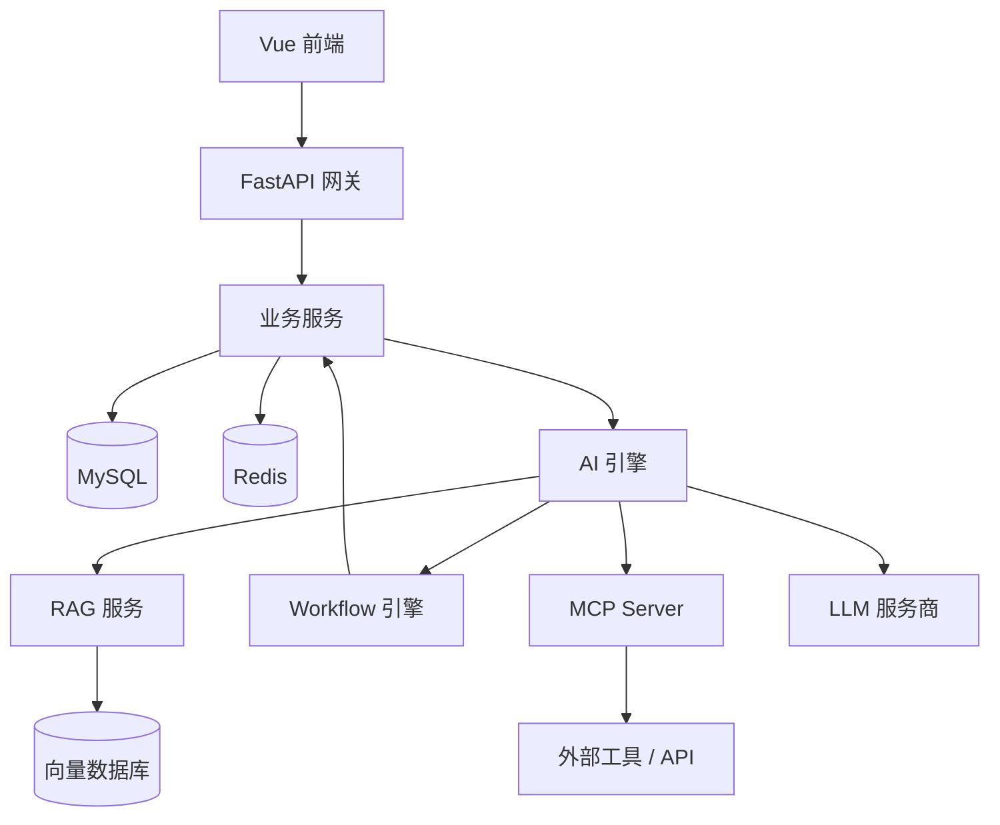
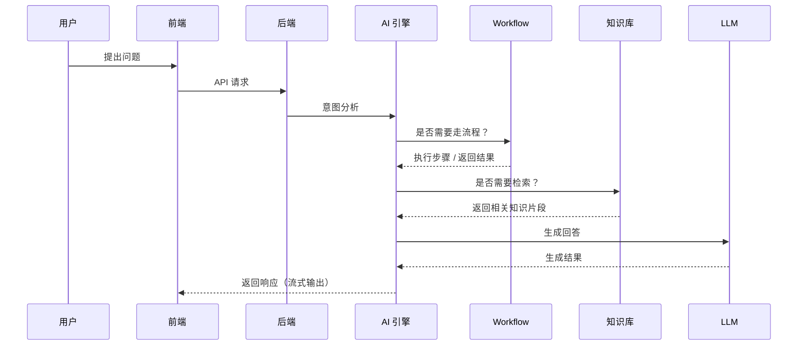
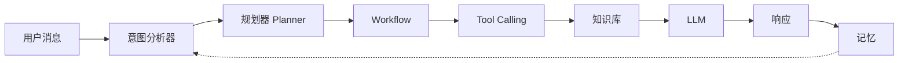
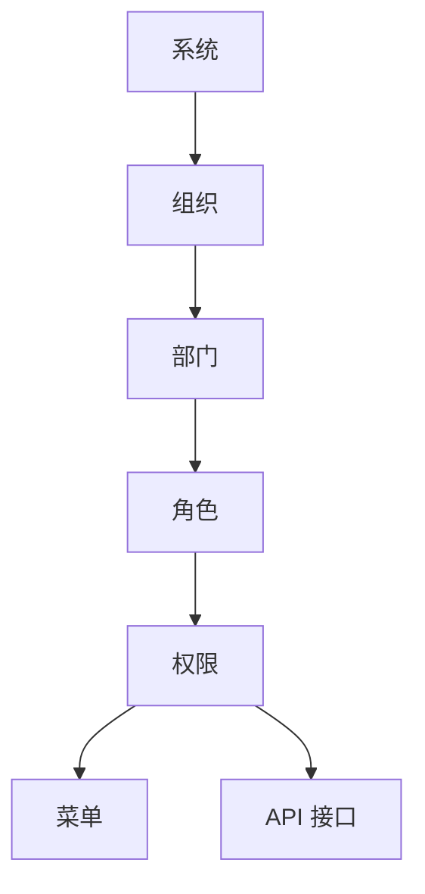
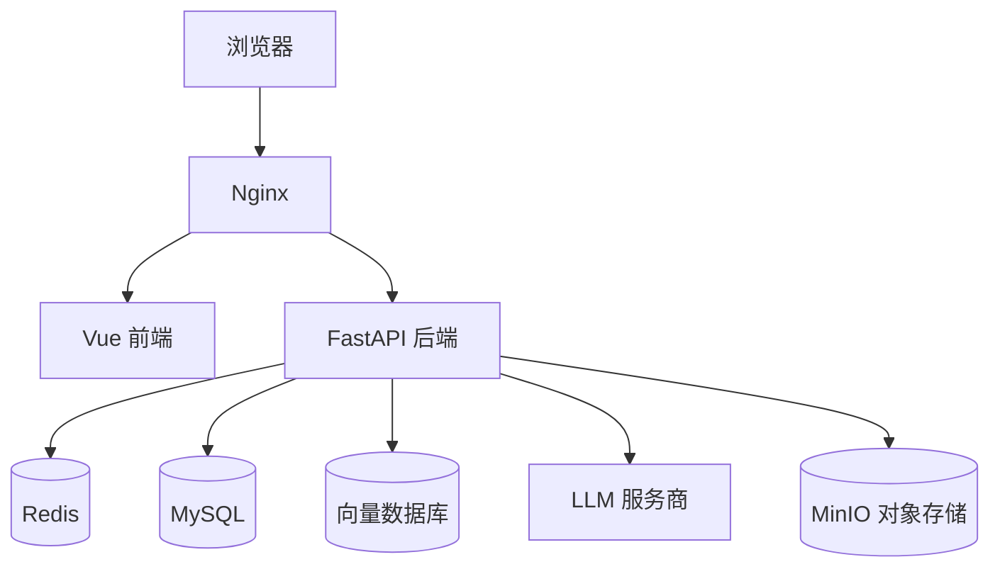
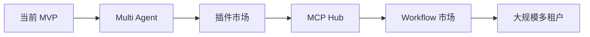
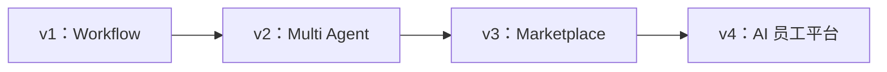

# WorkMind 系统设计文档

> 版本：v0.1 | 状态：草稿 | 日期：2026-07-16
> 关联文档：[产品需求文档](../product/requirements.md) · [架构总览](overview.md) · [Roadmap](../roadmap/roadmap.md)
> English version: [system-design.md](system-design.md)

---

## 第一章：设计原则（Design Principles）

WorkMind 遵循以下设计原则。本文档中的每一个架构决策，都应该能追溯回这些原则之一。

### 1.1 模块化（Modular）

每个模块都应该能独立开发、独立测试、独立部署。

模块之间通过明确定义的 API 通信，而不是共享内部状态。任何一个模块被替换时，不需要重写它周围的其他模块。

### 1.2 AI 优先（AI First）

每一个业务模块都应该能够接入 AI。

AI 不是挂在产品外面的一个独立功能，而是一种能力。就像任何模块都能调用数据库一样，Workflow、知识库、任务中心也都应该能调用 AI。

### 1.3 插件化（Plugin-oriented）

所有 AI 能力都应该是可扩展的，而不是硬编码在核心引擎里的。

- 支持 MCP（Model Context Protocol）
- 支持 Tool Calling
- 支持自定义插件

新增能力不应该需要修改核心引擎代码。

### 1.4 云原生（Cloud Native）

- 默认支持 Docker 部署
- 支持无状态服务的水平扩展
- 未来支持 Kubernetes，且不需要为此重构现有架构

### 1.5 安全（Security）

- RBAC（基于角色的访问控制）
- 基于 JWT 的身份认证
- 所有状态变更操作都记录操作日志
- 每一个服务边界都有 API 级别的身份校验
- 组织之间的数据隔离（支持多租户安全）

### 1.6 可观测性（Observability）

- 全服务的结构化日志
- 请求量、延迟、AI Token 消耗的指标监控
- 跨服务的链路追踪，尤其是在一次用户请求会经过知识库、Workflow、LLM 多个服务的 AI 调用链路上

---

## 第二章：整体架构（Architecture Overview）

WorkMind 分为三层：前端层、网关/业务层、AI/数据层。AI 层不是业务层旁边的一个附加功能，而是与业务层并列、双向可达的核心层。

**如何理解这张图：**

- **前端**永远不直连 AI 引擎，所有请求都要经过网关，这样鉴权、限流、日志能在一个地方统一收口。
- **AI 引擎**是整个架构的枢纽。它可以调用知识库做检索（RAG），可以触发 Workflow，也可以通过 MCP 连接外部工具——而 Workflow 又能回调业务服务，去真正修改数据（创建记录、发送通知）。
- **向量数据库**和 MySQL 是分开的两个存储。结构化业务数据和语义知识的访问模式完全不同，不应该混在同一个存储里。

---

## 第三章：核心模块（Core Modules）

每个模块拥有清晰的职责边界。任何模块要用到另一个模块的能力，只能通过它的 API，不能直接伸手进去操作内部数据。

### 用户中心（User Center）

负责：
- 用户账号与个人信息
- 组织与成员关系
- 登录、会话、JWT 签发

### 知识中心（Knowledge Center）

负责：
- 知识库管理
- 文档接入
- OCR（扫描件/图片文档识别）
- Embedding 生成
- 切片（Chunking）策略
- 检索（语义检索 + 关键词检索）

### Workflow 引擎（Workflow Engine）

负责：
- 工作流定义与版本管理
- 审批流程
- 任务编排
- 自动执行与触发器（定时触发、事件触发）

### AI 引擎（AI Engine）

负责：
- LLM 调用与厂商适配
- Prompt 管理
- Agent 执行
- Tool Calling
- 记忆（短期对话记忆、长期上下文记忆）
- 规划（Planning，把一个目标拆解成多个步骤）

### 插件中心（Plugin Center）

负责：
- MCP Server / Client 接入
- 插件注册与生命周期管理
- 第三方 API 适配

### 任务中心（Task Center）

负责：
- 任务队列与状态追踪
- 调度器（定时任务、事件驱动任务）
- 后台任务执行与重试

### 系统中心（System Center）

负责：
- 日志与审计追踪
- 监控与指标
- 系统配置
- AI 模型注册与路由（决定哪类请求由哪个模型处理）

---

## 第四章：系统流程（System Workflow）

下面这张时序图展示的是一个既需要 Workflow 决策、又需要知识检索的完整用户请求——这是通用场景，不是简单聊天场景。

不是每一次请求都会走完所有分支。一个简单的事实性问题会直接跳过 Workflow。一个"帮我提交报销"的请求会跳过知识库，直接走 Workflow。具体走哪条分支，由第五章介绍的意图分析器（Intent Analyzer）针对每次请求单独决定。

---

## 第五章：AI 架构（AI Architecture）

这一章，是 WorkMind 和其他产品最大的区别所在。核心思路是：**用户的一句话是一个目标（Goal），不只是一个 Prompt。** 系统要先判断达成这个目标需要做什么，然后才调用 LLM 把结果组织成语言。

### 5.1 处理流水线

- **意图分析器（Intent Analyzer）**——判断用户到底想干什么：是提问、是任务、是审批、还是查询。
- **规划器（Planner）**——对于超出单轮问答的请求，把目标拆解成有顺序的多个步骤。
- **Workflow**——执行映射到既定业务流程的步骤（审批、拉取数据、发送通知）。
- **Tool Calling**——把每个具体工具调用（搜索、计算、内部 API）当作独立的执行步骤。
- **知识库（Knowledge）**——当回答必须引用企业特有信息时，检索相关背景内容。
- **LLM**——基于以上所有已获取的信息，生成最终的自然语言回答。
- **记忆（Memory）**——保存本轮交互（短期用于当前对话，长期用于未来对话），并反馈给下一次意图分析。

### 5.2 为什么不用 LangChain？

LangChain 的核心抽象是 Chain：一条线性或轻度分支的调用序列。而 WorkMind 的核心需求是**带状态回溯的规划能力**——系统需要在任务执行中途决定是否再调用一次工具，需要在某个 Workflow 步骤失败后重新规划，需要带着更精确的查询词回到知识检索这一步重试。这些都是"环"，不是"管道"，Chain 这种线性结构并不适合承载这种控制流。

### 5.3 为什么用 LangGraph？

LangGraph 把 AI 引擎建模成一个显式的状态图。每个节点（意图分析器、规划器、Workflow、Tool Calling、知识库、LLM）都是图上的一个节点，拥有自己的状态转移。这带来三个关键能力：

- **支持环（Cycles）**——规划器可以在某个步骤的结果改变了原有计划时，把控制权重新交回 Tool Calling。
- **显式状态（Explicit State）**——整个执行状态（已检索了什么、已调用了什么、还有什么待处理）是可检查的，这正是[产品需求文档](../product/requirements.md#第十一章产品原则product-principles)中"AI 回答必须可追溯"这一原则在架构层面的落地。
- **断点续跑（Checkpointing）**——一个长时间运行的 Agent 任务可以暂停后再恢复，这是 Chain 原生不具备的能力。

### 5.4 为什么要做 Planning？

大多数 AI 聊天产品把每一条消息都当作一次单独的 LLM 调用：输入 Prompt，输出 Completion。这对问答场景够用。但对"处理这张发票并通知财务"这类请求不够用——这类请求实际上是五到十个离散的步骤，其中好几步的执行依赖于上一步的结果。Planning 正是让 WorkMind 从一个聊天机器人变成能像员工一样"办事"的关键：先把目标拆解，再执行，并且能在某一步的结果改变后续需求时调整计划。

### 5.5 为什么要支持 MCP？

Model Context Protocol 提供了一套标准化方式，让 AI 引擎发现和调用外部工具、外部数据源，且不依赖具体是哪家 LLM。如果没有 MCP，每接入一个新工具都要针对某一个模型的 Function Calling 格式单独写一套适配代码。有了 MCP：

- 工具和插件的开发者只需要写一次集成，就能被任何兼容 MCP 的模型使用。
- 第三章提到的插件中心，可以把内部能力（知识检索、Workflow 触发）以 MCP Server 的形式对外暴露，不仅 WorkMind 自己的 AI 引擎能用，外部的 AI 客户端也能接入使用。
- 切换 LLM 服务商（OpenAI → Claude → DeepSeek → Qwen，对应 PRD 中的模型兼容性要求）时，不需要重写工具集成代码。

---

## 第六章：权限架构（Permission Architecture）

权限遵循严格的层级结构。下一层永远不能获得没有被上一层授权的访问范围——这正是随着组织架构扩大，多租户、多部门数据仍能保持隔离的关键。

- **系统（System）**——平台级别，控制哪些组织存在，以及全局配置。
- **组织（Organization）**——一个租户。该层以下的所有数据都被限定在组织范围内，默认不存在跨组织的数据访问。
- **部门（Department）**——组织内部的细分单位（HR、销售、运营）。用于数据可见性范围控制（例如某部门的 Workflow 实例默认只在该部门内可见，除非显式共享）。
- **角色（Role）**——一组权限的集合（管理员、编辑者、查看者），可分配给部门内的用户。
- **权限（Permission）**——最小的权限单元：针对某一种资源类型的某一个具体操作。
- **菜单 / API**——权限最终会落地到两个执行点：前端可见什么（菜单）、后端可调用什么（API）。前端校验只是用户体验层面的处理，真正的安全边界在 API 层——前端隐藏一个按钮从来都不足以作为安全保障。

RBAC 的判定发生在每一次请求的 API 层，而不是缓存进一个长期有效、超出 JWT 自身声明范围的会话令牌里，所以权限被收回后会在下一次请求时立刻生效，不需要等待 Token 过期。

---

## 第七章：部署架构（Deployment Architecture）

- **Nginx** 负责 TLS 终止，并把请求路由到静态前端资源和后端 API。
- **Vue 前端**以静态构建产物的形式提供，MVP 阶段不需要服务端渲染。
- **FastAPI 后端**是唯一的无状态服务层，所有持久化都在外部完成，所以后端可以在 Nginx 后面部署任意数量的实例。
- **Redis** 负责会话/缓存和短期对话状态。
- **MySQL** 存放结构化业务数据（用户、组织、Workflow、权限、审计日志）。
- **向量数据库**存放用于 RAG 检索的文档向量。
- **MinIO** 以 S3 兼容的对象存储方式保存上传文件（文档、OCR 用到的图片），避免把大体积二进制内容塞进 MySQL。
- **LLM 服务商**是外部依赖，且可替换——详见第九章。

MVP 阶段整套服务以 Docker Compose 的形式交付，上图中每一个方框对应一个容器。Kubernetes 编排文件是后续计划中的能力（见第八章），只在真正需要水平扩展时才引入，不提前做。

---

## 第八章：扩展性设计（Scalability）

MVP 架构有意留出了以下这些方向的演进空间，不需要推翻重写：

- **Multi Agent**——多个 Agent 协作完成同一个目标，每个 Agent 的职责更窄（例如一个"检索 Agent"和一个"撰写 Agent"共同完成一次请求）。
- **插件市场（Plugin Marketplace）**——第三方开发者发布插件，供其他组织安装使用，而不只是自己内部使用。
- **MCP Hub**——一个中心化的 MCP Server 注册表，WorkMind 的各个组织可以直接发现和接入，不需要每家单独配置工具。
- **Workflow 市场**——预置好的工作流模板（入职流程、报销审批、销售跟进），组织可以直接安装并二次定制，而不用从零搭建。
- **大规模多租户**——从"共享表中按组织字段区分数据行"演进到"大客户独享资源池"，在某个租户的规模足以支撑这个成本时再做。

这一章内容，从功能上讲，也基本就是未来商业版/付费版的形态：MVP 是产品本身，这一章列的都是叠加在它之上、可以对外销售的部分。

---

## 第九章：技术决策（Technical Decisions）

| 决策 | 原因 |
|---|---|
| FastAPI | Python 生态在 AI/ML 方向成熟，原生异步，配合 Pydantic 有较强的类型约束 |
| Vue 3 | 开发效率高，Composition API 适合这类以中后台管理界面为主的产品形态 |
| Redis | 低延迟缓存，用于会话管理和进行中的对话状态 |
| MySQL | 成熟稳定，工具链完善，适合业务数据占比较高的场景 |
| pgvector / 向量数据库 | 原生支持向量相似度检索，服务于 RAG |
| LangGraph | 基于图结构的执行引擎，支持环和可检查的状态，是第五章 Planning 能力的基础 |
| Docker | 部署方式可预测、可移植，适合 MVP 阶段和私有化部署场景 |
| JWT | 无状态身份认证，水平扩展时不需要共享会话存储 |
| MinIO | S3 兼容的对象存储，可自建私有化部署，避免把二进制文件存进 MySQL |
| MCP | 与具体模型无关的工具/插件协议，避免在 Function Calling 格式上被单一厂商锁定 |

这些决策是可以被复盘的，不是一成不变的。如果某个决策发生变化，应该在这里以带日期的补充说明的形式记录下来，而不是直接覆盖删除，这样决策背后的推理过程才能被完整保留下来。

---

## 第十章：未来演进（Future Evolution）

- **v1 —— Workflow**：先把核心闭环跑通——知识库、AI 对话、一个能用的 Workflow 引擎。这对应[产品需求文档](../product/requirements.md#第七章mvp范围mvp-scope)中定义的 MVP 范围。
- **v2 —— Multi Agent**：从"一个 Agent 处理一次请求"演进到"多个 Agent 协作"，每个 Agent 职责更窄，每一步都更容易被审查追溯。
- **v3 —— Marketplace**：把平台开放出去——插件、Workflow 模板、MCP 工具，变成组织可以直接安装的东西，而不是必须自己开发。
- **v4 —— AI 员工平台**：PRD 产品定位中所描述的终局状态——不是一个员工用来干活的工具，而是一整套企业可以"招聘"、分配任务、管理的 AI 员工。

每一个版本都应该建立在前一版系统设计的基础之上，不需要重写下层架构——这也是第一、第二章反复强调模块化、坚持层与层之间清晰 API 边界的原因。
