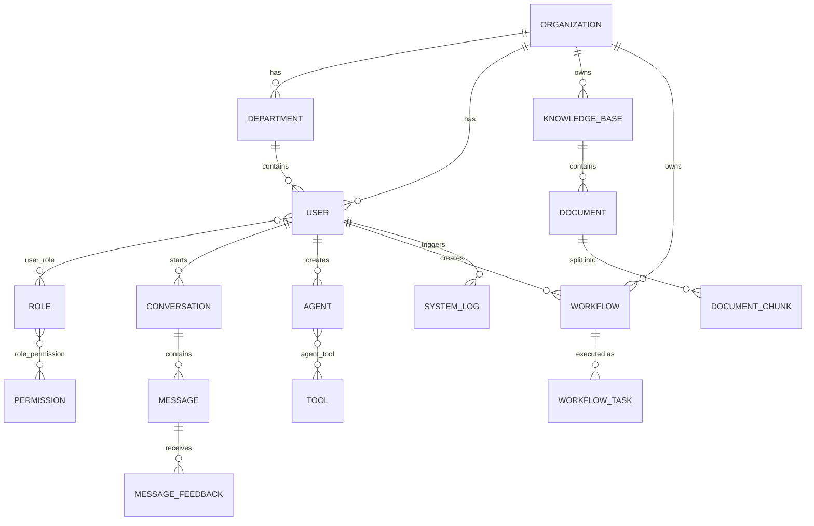

# WorkMind 数据库设计文档

> 版本：v0.1 | 状态：草稿 | 日期：2026-07-16
> 关联文档：[产品需求文档](../product/requirements.md) · [系统设计文档](../architecture/system-design.zh-CN.md)

---

## 1. 数据库概述（Database Overview）

WorkMind 采用 MySQL 作为主存储，承载所有结构化业务数据（用户、组织、权限、Workflow、日志等）；向量检索相关的 Embedding 数据存放在独立的向量数据库中（见[系统设计文档第七章](../architecture/system-design.zh-CN.md#第七章部署架构deployment-architecture)），两者通过 `document_chunk` 表中的引用字段关联。

本文档描述的是 MySQL 中的表结构设计，不包含向量数据库内部的索引结构（HNSW / IVF 等由向量数据库自身管理）。

数据库按业务领域分为六组：

| 分组 | 包含表 | 说明 |
|---|---|---|
| 用户与权限 | organization, department, user, role, permission, role_permission, user_role | 组织架构与 RBAC |
| 知识库 | knowledge_base, document, document_chunk | 知识管理与 RAG 检索 |
| 对话系统 | conversation, message, message_feedback | AI 对话与反馈 |
| AI 能力 | agent, tool, agent_tool | Agent 与工具调用 |
| 工作流 | workflow, workflow_task | 流程编排与执行记录 |
| 系统 | system_log | 审计与操作日志 |

---

## 2. 数据库设计原则（Database Design Principles）

### 2.1 企业级多租户（Enterprise Multi Tenant）

支持多个组织（Organization）同时使用同一套系统。几乎所有业务表都带有 `org_id` 字段，作为数据归属的第一道边界。

### 2.2 数据隔离（Data Isolation）

不同组织之间的数据不能互相访问。查询层必须在每一次涉及业务数据的查询中携带 `org_id` 过滤条件，这一约束在应用层（ORM 中间件）统一强制，而不是依赖每个开发者手写时记得加。

### 2.3 可扩展（Extensible）

表结构要为未来的 Agent、Plugin、Multi-Agent 协作留出空间。凡是"配置类"的复杂结构（Agent 的系统提示词、Tool 的调用 Schema、Workflow 的节点定义）都用 `JSON` 字段承载，而不是拆成大量强类型列，避免每次加一个新能力都要改表结构。

### 2.4 可审计（Auditability）

重要操作必须被记录，且记录不可篡改、不可删除。`system_log` 表只允许插入（Append-only），不提供业务层的更新或删除接口。

---

## 3. ER 模型（ER Model）



**关键关系说明：**

- 一个组织下有多个部门、多个用户，知识库和 Workflow 也归属于组织，这是数据隔离的边界起点。
- 用户与角色是多对多（一个用户可以有多个角色），角色与权限也是多对多，中间通过 `user_role`、`role_permission` 两张关联表落地，这是标准 RBAC 设计。
- 一个知识库下有多篇文档，一篇文档切分成多个 Chunk，Chunk 是 RAG 检索真正命中的最小单元。
- 一个 Agent 可以绑定多个 Tool，一个 Tool 也可以被多个 Agent 复用，中间用 `agent_tool` 关联。
- Workflow 是定义（模板），Workflow Task 是每一次具体的执行记录，一对多。

---

## 4. 核心表设计（Core Tables）

### 4.1 用户与权限

#### organization（组织）

| 字段 | 说明 |
|---|---|
| id | 主键 |
| name | 组织名称 |
| status | 状态（正常/禁用） |
| created_at | 创建时间 |

#### department（部门）

| 字段 | 说明 |
|---|---|
| id | 主键 |
| org_id | 所属组织 |
| name | 部门名称 |
| parent_id | 上级部门（支持多级部门树） |

#### user（用户）

| 字段 | 说明 |
|---|---|
| id | 主键 |
| org_id | 所属组织 |
| dept_id | 所属部门 |
| username | 用户名 |
| password_hash | 密码哈希（不存明文） |
| email | 邮箱 |
| status | 状态（正常/禁用） |
| created_at | 创建时间 |

#### role（角色）

| 字段 | 说明 |
|---|---|
| id | 主键 |
| org_id | 所属组织 |
| name | 角色名称 |
| description | 描述 |

#### permission（权限）

| 字段 | 说明 |
|---|---|
| id | 主键 |
| code | 权限编码（如 `knowledge:document:delete`） |
| type | 类型（菜单 / API） |
| resource | 关联的菜单路径或 API 路径 |

#### user_role / role_permission（关联表）

标准多对多中间表，只存两侧外键 + 创建时间，不承载额外业务字段。

---

### 4.2 知识库

#### knowledge_base（知识库）

| 字段 | 说明 |
|---|---|
| id | 主键 |
| org_id | 所属组织 |
| name | 知识库名称 |
| description | 描述 |
| owner_id | 创建者 |
| vector_store | 关联的向量数据库 collection 名称 |
| status | 状态 |

#### document（文档）

| 字段 | 说明 |
|---|---|
| id | 主键 |
| kb_id | 所属知识库 |
| file_name | 文件名 |
| file_path | 存储路径（MinIO） |
| file_type | 文件类型（PDF / Word / TXT / 图片） |
| status | 处理状态（待处理 / 切片中 / 已完成 / 失败） |
| uploaded_by | 上传人 |
| created_at | 上传时间 |

#### document_chunk（文档切片）

这是 AI 项目里最容易被追问细节的一张表，因为它是"原文 → Chunk → Embedding → 向量数据库"这条链路在关系数据库侧的落点。

| 字段 | 说明 |
|---|---|
| id | 主键 |
| document_id | 所属文档 |
| chunk_index | 切片顺序号（保证能还原原文顺序） |
| content | 切片文本内容 |
| token_count | 该切片的 Token 数（用于成本与检索质量分析） |
| vector_id | 该切片在向量数据库中的向量 ID（跨库引用，不存向量本身） |
| created_at | 创建时间 |

**数据流转说明：**

```
原始文档（document）
    ↓ 切片
文档切片（document_chunk，存文本 + 顺序）
    ↓ Embedding
向量（存入向量数据库，document_chunk.vector_id 指回来源）
    ↓ 检索时
用户问题 → 向量检索 → 命中 vector_id → 反查 document_chunk.content → 拼入 Prompt
```

MySQL 里的 `document_chunk` 永远保留人类可读的原文，向量数据库只保留向量和最基本的元数据，两者通过 `vector_id` 单向引用，避免向量数据库成为唯一真源（一旦向量数据库需要重建索引，原文不会丢）。

---

### 4.3 对话系统

不按"简单聊天记录"来设计，因为后续 Agent 的 Memory、多轮任务追踪都要复用这套表。

#### conversation（会话）

| 字段 | 说明 |
|---|---|
| id | 主键 |
| org_id | 所属组织 |
| user_id | 所属用户 |
| agent_id | 关联的 Agent（可为空，纯聊天场景不绑定 Agent） |
| title | 会话标题 |
| status | 状态（进行中 / 已结束） |
| created_at | 创建时间 |

#### message（消息）

| 字段 | 说明 |
|---|---|
| id | 主键 |
| conversation_id | 所属会话 |
| role | 角色（user / assistant / tool / system） |
| content | 消息内容 |
| tool_calls | 本条消息触发的工具调用记录（JSON，可为空） |
| retrieved_chunks | 本条回答引用的 document_chunk ID 列表（JSON，支撑"可追溯"原则） |
| created_at | 创建时间 |

#### message_feedback（消息反馈）

| 字段 | 说明 |
|---|---|
| id | 主键 |
| message_id | 所属消息 |
| user_id | 反馈人 |
| rating | 评价（赞 / 踩） |
| comment | 补充说明 |
| created_at | 创建时间 |

`message.retrieved_chunks` 是 RAG 可追溯性在数据库层的直接体现——对应[产品需求文档第十一章](../product/requirements.md#第十一章产品原则product-principles)"所有 AI 回答必须可追溯"的原则：不是靠模型自己声明引用了什么，而是系统在生成回答的那一刻就把用到的 Chunk ID 记下来。

---

### 4.4 AI 相关表

这一组表是 WorkMind 和普通后台管理系统最大的区别所在。

#### agent（Agent）

| 字段 | 说明 |
|---|---|
| id | 主键 |
| org_id | 所属组织 |
| name | Agent 名称 |
| description | 描述 |
| model | 使用的模型（如 gpt-4o / claude-sonnet / deepseek-chat） |
| system_prompt | 系统提示词 |
| status | 状态（启用 / 禁用） |
| creator_id | 创建人 |

#### tool（工具）

面向未来的 MCP 接入设计，一张表同时覆盖"内部工具"和"外部 MCP 工具"两种类型。

| 字段 | 说明 |
|---|---|
| id | 主键 |
| org_id | 所属组织 |
| name | 工具名称 |
| type | 类型（内置函数 / HTTP API / MCP Server） |
| endpoint | 调用地址（HTTP URL 或 MCP Server 地址，内置函数可为空） |
| schema | 输入输出参数的 JSON Schema |
| status | 状态 |

#### agent_tool（关联表）

支持一个 Agent 绑定多个 Tool，一个 Tool 被多个 Agent 复用。

| 字段 | 说明 |
|---|---|
| id | 主键 |
| agent_id | Agent |
| tool_id | Tool |
| created_at | 绑定时间 |

---

### 4.5 工作流

#### workflow（工作流定义）

| 字段 | 说明 |
|---|---|
| id | 主键 |
| org_id | 所属组织 |
| name | 工作流名称 |
| definition_json | 流程定义（节点、连线、触发条件，JSON 结构） |
| creator_id | 创建人 |
| status | 状态（启用 / 禁用） |
| created_at | 创建时间 |

#### workflow_task（工作流任务执行记录）

工作流本身是模板，`workflow_task` 才是每一次具体跑起来的实例，未来"AI 自动执行"的可观测性全部依赖这张表。

| 字段 | 说明 |
|---|---|
| id | 主键 |
| workflow_id | 所属工作流定义 |
| trigger_type | 触发方式（手动 / 定时 / 事件） |
| status | 执行状态（等待中 / 执行中 / 成功 / 失败） |
| input_data | 触发时的输入参数（JSON） |
| output_data | 执行结果（JSON） |
| error_message | 失败原因（失败时记录） |
| started_at | 开始时间 |
| finished_at | 结束时间 |

---

### 4.6 系统日志

#### system_log（系统日志）

| 字段 | 说明 |
|---|---|
| id | 主键 |
| org_id | 所属组织 |
| user_id | 操作人（系统自动触发时可为空） |
| action | 操作类型（如 `user.login`、`document.delete`） |
| target_type | 操作对象类型 |
| target_id | 操作对象 ID |
| detail | 详情（JSON） |
| ip_address | 操作来源 IP |
| created_at | 操作时间 |

Append-only 表，不提供 UPDATE / DELETE 接口，只允许按时间维度归档迁移到冷存储。

---

## 5. 表定义（Table Definition）

以核心表 `document_chunk` 和 `workflow_task` 为例给出完整 DDL，其余表按同一规范补齐。

```sql
CREATE TABLE document_chunk (
    id              BIGINT UNSIGNED PRIMARY KEY AUTO_INCREMENT,
    document_id     BIGINT UNSIGNED NOT NULL,
    chunk_index     INT UNSIGNED NOT NULL,
    content         TEXT NOT NULL,
    token_count     INT UNSIGNED NOT NULL DEFAULT 0,
    vector_id       VARCHAR(64) NOT NULL,
    created_at      DATETIME NOT NULL DEFAULT CURRENT_TIMESTAMP,
    FOREIGN KEY (document_id) REFERENCES document(id)
) ENGINE=InnoDB DEFAULT CHARSET=utf8mb4;

CREATE TABLE workflow_task (
    id              BIGINT UNSIGNED PRIMARY KEY AUTO_INCREMENT,
    workflow_id     BIGINT UNSIGNED NOT NULL,
    trigger_type    VARCHAR(16) NOT NULL,
    status          VARCHAR(16) NOT NULL DEFAULT 'pending',
    input_data      JSON NULL,
    output_data     JSON NULL,
    error_message   VARCHAR(512) NULL,
    started_at      DATETIME NULL,
    finished_at     DATETIME NULL,
    created_at      DATETIME NOT NULL DEFAULT CURRENT_TIMESTAMP,
    FOREIGN KEY (workflow_id) REFERENCES workflow(id)
) ENGINE=InnoDB DEFAULT CHARSET=utf8mb4;
```

**统一规范：**

- 所有表使用 `InnoDB` 引擎、`utf8mb4` 字符集（兼容 Emoji 和多语言内容）
- 主键统一使用 `BIGINT UNSIGNED AUTO_INCREMENT`
- 所有表都有 `created_at`，涉及状态变更的表额外加 `updated_at`
- 软删除统一用 `deleted_at`（NULL 表示未删除），不做物理删除，除 `system_log` 外其余业务表默认遵循此规则

---

## 6. 索引设计（Index Design）

索引设计的原则：覆盖高频查询路径 + 覆盖多租户隔离字段。几乎每张业务表的第一个索引都应该是 `org_id`，或者是"`org_id` 打头的复合索引"。

| 表 | 索引 | 用途 |
|---|---|---|
| user | `UNIQUE INDEX (org_id, username)` | 登录查询，且用户名只需在组织内唯一 |
| user | `INDEX (email)` | 找回密码、邮箱登录 |
| knowledge_base | `INDEX (org_id)` | 按组织列出知识库 |
| document | `INDEX (kb_id)` | 按知识库列出文档 |
| document | `INDEX (kb_id, status)` | 筛选某知识库下处理失败/待处理的文档 |
| document_chunk | `INDEX (document_id, chunk_index)` | 按文档还原切片顺序 |
| document_chunk | `UNIQUE INDEX (vector_id)` | 向量库命中后反查原文，要求唯一 |
| conversation | `INDEX (user_id, created_at)` | 用户会话列表按时间排序 |
| message | `INDEX (conversation_id, created_at)` | 会话内消息按时间拉取，这是最高频查询 |
| agent_tool | `UNIQUE INDEX (agent_id, tool_id)` | 防止重复绑定，同时加速按 Agent 查工具列表 |
| workflow_task | `INDEX (workflow_id, created_at)` | 查看某个工作流的历史执行记录 |
| workflow_task | `INDEX (status, created_at)` | 调度器扫描待执行/执行中的任务，这是任务系统最核心的查询 |
| system_log | `INDEX (org_id, created_at)` | 按组织按时间查审计日志 |
| system_log | `INDEX (user_id, created_at)` | 按操作人查日志 |

**特别说明 `workflow_task (status, created_at)`：** 任务调度器需要持续扫描"状态为等待中"的任务，这是一个持续高频的轮询查询（或者由消息队列触发，但监控页面仍需要按状态筛选），`status` 放在复合索引最前面能让筛选直接命中索引，`created_at` 用于排序，避免额外的文件排序（filesort）。

---

## 7. 未来扩展（Future Extension）

以下方向在当前表结构设计时已预留扩展空间，不需要在 v1 阶段实现，但表结构不应阻碍它们后续加入：

- **Multi-Agent 协作**：`conversation` 表的 `agent_id` 未来可扩展为多对多（一次会话涉及多个 Agent 协作），需要新增 `conversation_agent` 关联表，不影响现有结构。
- **Workflow 可视化节点级追踪**：当前 `workflow_task` 只记录整个流程的执行结果，未来若需要记录每个节点的执行明细，可新增 `workflow_task_step` 子表，通过 `task_id` 关联。
- **插件市场**：`tool` 表的 `type` 字段已包含 MCP Server 类型，未来插件市场上架/安装记录可新增 `plugin_install` 表，与 `tool` 建立引用关系，不需要改动 `tool` 表本身。
- **向量数据库多集合路由**：`knowledge_base.vector_store` 当前存单个 collection 名称，未来若支持按文档类型拆分到不同向量集合，可将该字段拆到单独的路由配置表，主表结构不受影响。
- **审计日志归档**：`system_log` 数据量增长后，按时间分表或归档到独立的日志存储（如 ClickHouse），当前表结构的字段设计已支持直接迁移，不需要转换。
